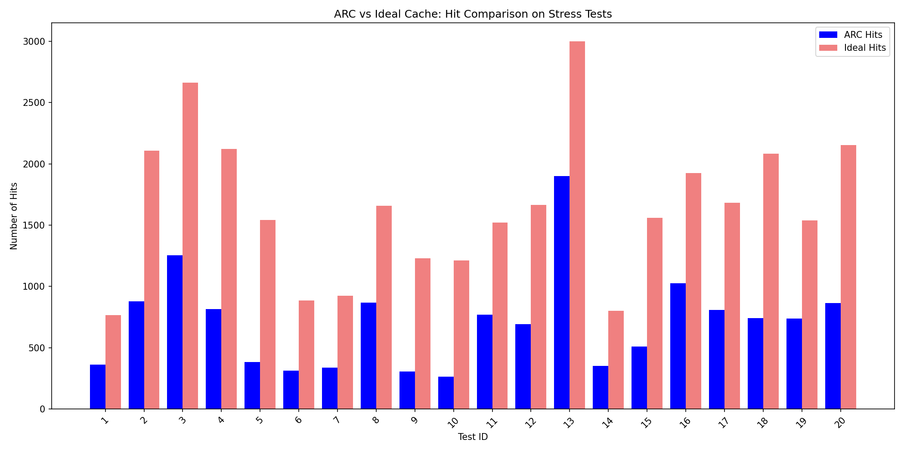

# Adaptive Replacement Cache (ARC) && Optimal Cache Replacement Algorithm (OPT)

## Project idea

The **Adaptive Replacement Cache (ARC)** is a caching algorithm designed to balance
**recency** (recently accessed items) and **frequency** (frequently accessed items) adaptively
without explicitly storing frequency counters.

The **Optimal Cache Replacement Algorithm** (also known as **Belady’s algorithm**) is a theoretical cache eviction strategy that achieves the minimum possible number of page faults (or, equivalently, the maximum number of cache hits) for a given cache size and request sequence.

It works by looking into the future: when a cache miss occurs and the cache is full, it evicts the page that will not be used for the longest time in the future (or will never be used again).

> [!NOTE]
> **OPT** is not implementable in real systems because it requires knowledge of future requests. ? > However, it serves as a gold standard for evaluating the performance of practical cache algorithms (like *LRU*, *ARC*, etc.).

In this project, the **OPT** cache is used as a benchmark to measure how close adaptive algorithms (e.g., **ARC**) come to the theoretical optimum.

## How to install

```bash
git clone https://github.com/daniilgriga/ARC.git
cd ARC/
```

## How to build

```bash
mkdir build
cmake -S . -B build
cmake --build build
```
## About testing

### ARC

There are small manual tests that I invented, and I calculated the answers to them on paper with my own hands.

Launch in project root directory:

```bash
cd tests/ARC/
./run_tests.sh ../../build/arc
```

### OPT

Test cases for the **Optimal (OPT) cache** are automatically generated by a Python script (*gen_tests.py*).
This script:

- Creates random and pattern-based request sequences (including stress tests),
- Computes the exact number of cache hits using a built-in simulation of **Belady’s optimal algorithm**,
- Saves each test as a `.dat` file (input) and a corresponding `.ans` file (expected hit count).

This ensures that all test answers are mathematically correct and independent of any implementation, providing a reliable benchmark for validation.

Launch in project root directory:

```bash
cd tests/Ideal/
./run_tests.sh ../../build/ideal
```

### Comparison

These tests are generated to compare caches. Based on these tests, I built a *histogram*.

Launch in project root directory:

```bash
cd tests/comparison/
./run_tests.sh
```


